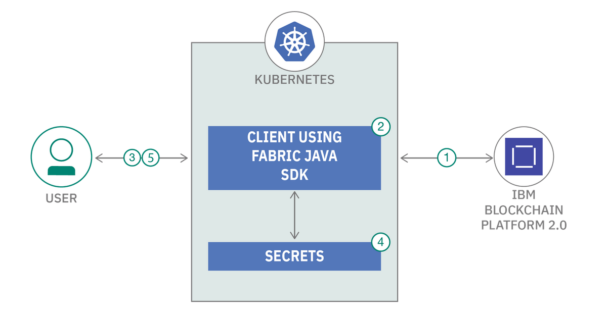
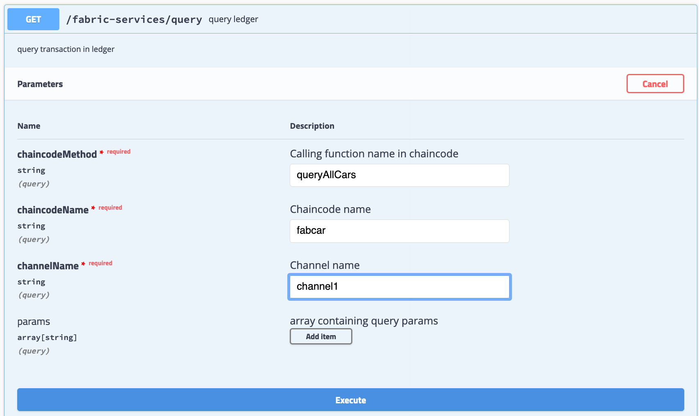

## NOTE: This repository has been archived and no longer maintained!


## Use Kubernetes secrets as Hyperledger Fabric wallet using Fabric Java SDK

Security on the Hyperledger Fabric is enforced with digital signatures. All requests made to the fabric must be signed by users with appropriate enrolment certificates. Once user is enrolled, application persist certificate in wallet for future usages.

There are existing Fabric wallets like FileSystemWallet, CouchDBWallet which developers can leverage to store Blockchain identities. The security concern with these implementations is that they “externalize” associated privateKey of the identity which can be compromised if someone get access to these storage systems. Generally front-end client application and client SDK application (integration layer) gets deployed in the containerized environment i.e. into Kubernetes platform. So how about storing the wallet into Kubernetes platform itself? It would be considered more secure since it removes dependency to store wallet outside of Kubernetes platform.

Hence this code pattern demonstrates the methodology to store wallet into Kubernetes platform as secrets and use of those secrets further during transactions.

At the end of this code pattern, the users will understand how-to: 
* store wallet as Kubernetes secrets 
* use secrets while performing transaction using Fabric JAVA SDK

## Flow



1. Set up Hyperledger Fabric network using IBM Blockchain Platform.
2. Deploy the client application built using Fabric Java SDK to communicate with blockchain network on IBM Kubernetes Cluster.
3. Users with Admin identity registers new users to the blockchain network and then new users enroll to the network.
4. The generated certificates will be stored as Kubernetes Secret. 
5. The certificates from Kubernetes Secrets will be used to do further transactions with blockchain network.


## Pre-requisites

* [IBM Cloud Account](https://cloud.ibm.com)
* [Git Client](https://git-scm.com/downloads)
* [JDK 11](http://jdk.java.net/archive/)
* [Maven](https://maven.apache.org/download.cgi)

## Steps

Follow these steps to setup and run this code pattern. The steps are described in detail below.
1. [Get the code](#1-get-the-code)
2. [Create IBM Cloud Services](#2-create-ibm-cloud-services)
3. [Setup Hyperledger Fabric Network using IBM Blockchain Platform](#3-setup-hyperledger-fabric-network-using-ibm-blockchain-platform)
4. [Register and enroll user to connect to Hyperledger Fabric Network](#4-register-and-enroll-user-to-connect-to-hyperledger-fabric-network)
5. [Deploy the Fabric Java SDK Client application on IBM Kubernetes Service](#5-deploy-the-fabric-java-sdk-client-application-on-ibm-kubernetes-service)
6. [Store Fabric wallet as Kubernetes secret](#6-store-fabric-wallet-as-kubernetes-secret)
7. [Access the client application](#7-access-the-client-application)

## 1. Get the code

- Clone the repo using the below command.
   ```
   git clone https://github.com/IBM/k8-secrets-as-hyperledger-fabric-wallet.git
   ```
   
## 2. Create IBM Cloud Services

**Create IBM Kubernetes Service Instance**

Create two Kubernetes cluster with [Kubernetes Service](https://cloud.ibm.com/kubernetes/catalog/create) using IBM Cloud Dashboard. One Kubernetes service is required to setup IBM Blockchain Platform and other one is required to deploy client application. Though you can use one Kubernetes service only but thats not the recommended approach.

  > Note: It can take up to 15-20 minutes for the cluster to be set up and provisioned.  

**Create IBM Blockchain Platform Service Instance**

Create [IBM Blockchain Platform Service](https://cloud.ibm.com/catalog/services/blockchain-platform) instance using IBM Cloud Dashboard.

## 3. Setup Hyperledger Fabric Network using IBM Blockchain Platform

Follow this [tutorial](https://developer.ibm.com/tutorials/quick-start-guide-for-ibm-blockchain-platform/) to create fabric network using IBM Blockchain Platform. You can decide network components (number of organizations, number of peers in each org etc.) as per your requirement. For example, the blockchain network may consist of two organizations with single peer each and an orderer service for carrying out all the transactions.

Make a note of the Organization CA `admin` username and password which you have created. It will be used further to register new users.

**Install & Instantiation of Chaincode and Download Connection Profile**

This code pattern can be executed with the sample chaincode [fabcar.go](https://github.com/hyperledger/fabric-samples/tree/release-1.4/chaincode/fabcar/go) or else you can install your own chaincode. Instantiate the chaincode after installation and then download the connection profile.

You can refer to step 12 to step 15 [here](https://developer.ibm.com/tutorials/quick-start-guide-for-ibm-blockchain-platform/) to install smart contract, instantiate and to download the connection profile. The downloaded connection profile will be used in further steps.

## 4. Register and enroll user to connect to Hyperledger Fabric Network

- Go to the cloned repository code.
   ```
   cd k8-secrets-as-hyperledger-fabric-wallet
   ```
   
- Copy the downloaded connection profile file(in previous step) at `src/main/resources`. The sample connection profile named as `sample_org1msp_profile.json` is available in repository.

- Replace `Your_Connection_Profile_Name` by the filename of your downloaded connection profile in `src/main/resources/application.yml`.

- Run the following commands in your terminal window. Make sure JDK11 and Maven path is set properly otherwise you will get errors. This command runs the utility class `application.secret.wallet.util.EnrollAdminAndUser` to register and enroll a new blockchain user using admin identity.

   ```
   mvn clean install
   mvn exec:java -Dexec.args="<your_connection_profile_filename> <admin_user_name> <admin_user_password> <new_user_name> <new_user_password>"
   ```
   
   > Note: Username and Password of admin identity should be the ones which was created in Step #3 above.
   
   The output of this command will have the base64 encoded MSP ID, certificate and private Key for the new blockchain user. Make a note of those, it will be used in further steps.
   
## 5. Deploy the Fabric Java SDK Client application on IBM Kubernetes Service

As discussed before, need to decide on which Kubernetes cluster you would like to deploy the application and deploy your Java SDK client application.

<!--
* Create a [toolchain](https://cloud.ibm.com/devops/create) to `Develop a Kubernetes App`.
* Follow the instructions to deploy your application explained as [Task 1](https://www.ibm.com/cloud/architecture/tutorials/use-develop-kubernetes-app-toolchain?task=1).
   * Select a source provider as `Github`.
   * You can choose to `fork` the repository in your Github account.
   * Provide [this repository](https://github.com/IBM/k8-secrets-as-hyperledger-fabric-wallet/) as `Source Repository URL`.
   * For ease, you can choose `default` namespace to deploy the application on Kubernetes Cluster.
-->

- Navigate to the root directory `k8-secrets-as-hyperledger-fabric-wallet` of the cloned repository code.

- Build and push your container image

   If you are using **IBM Cloud container registry** to store your container image, then build and push your image using the following command:

   ```
      $ ibmcloud cr build -t <deploy-target> .
   ```
   where deploy-target is `<region>.icr.io/<my_namespace>/<image_name>:<tag>` as explained [here](https://cloud.ibm.com/docs/Registry).

   If you want to use **Docker Hub** to store images then you should have your Docker Hub account. Create new [Docker Hub account](https://hub.docker.com/) if you do not have already and then execute the following steps:

   ```
      $ export DOCKER_HUB_USER=<your-dockerhub-username>
      $ docker build -t $DOCKER_HUB_USER/<image_name>:<tag> .
      $ docker push $DOCKER_HUB_USER/<image_name>:<tag>
   ```

- Update image location in `deployment.yaml`.

   ```
      $ sed -i '' s#IMAGE#<image_location># deployment.yaml     ## mac
      OR
      $ sed -i s#IMAGE#<image_location># deployment.yaml      ## linux
   ```
   where image_location is either `<deploy-target>` or `$DOCKER_HUB_USER/<image_name>:<tag>`.

- Deploy your application.

   ```
      kubectl create -f deployment.yaml
   ```

   Wait till the application gets deployed. 
   
- Get the public ip of your Kubernetes cluster using IBM Cloud Dashboard as `IBM Cloud Dashboard -> Clusters -> <your cluster> -> Worker Nodes (tab)`

- Access your application using:

   ```
      http://<public_ip_of_cluster>:32424/swagger-ui.html
   ```

At this stage, application will not work as expected because user's wallet is not yet provided. Follow the next step for that.

## 6. Store Fabric wallet as Kubernetes secret

In this step we will make wallet available as secret in the namespace in which the client application is deployed. Then application will use those secrets further to transact with blockchain network.

- Update `scripts/env_setup.yaml` with the base64 encoded values of new user. Use the values noted in [Step #4](#4-register-and-enroll-user-to-connect-to-hyperledger-fabric-network).

- Perform the steps provided under the access tab `IBM Cloud Dashboard -> Clusters -> <your cluster> -> Access` to get access of your cluster(where you have deployed the client application) through kubectl CLI.

- Run the below commands to store the blockchain user's credentials as Kubernetes secrets.

   ```
   cd scripts
   kubectl apply -f ./env_setup.yaml
   ```

- A secret can be used with a Pod in three ways - as files in a volume mounted, as container environment variable or by the kubelet when pulling images for the Pod. In this code pattern, we are using secret as container environment variable. Run the following command to expose Kubernetes secrets as container environment variables.

```
   kubectl set env --from=secret/wallet deployment/fabric-java-sdk-client-app
```
   
## 7. Access the client application

Access your application at:

```
   http://<public_ip_of_cluster>:32424/swagger-ui.html
```

You will get the below page on your browser.


Execute the `invoke` and `query` transactions for your chaincode. If you have deployed the sample `fabcar` chaincode, then you can execute the transactions using the values shown below. Else please provide the values as per your chaincode.

**Invoke**

Click on `Invoke Transaction > Try it out`. You can provide the following as `invokeRequest`, modify the details as per your network and then `Execute`.

```
{
  "chaincodeMethod": "createCar",
  "chaincodeName": "fabcar",
  "channelName": "channel1",
  "data": [
    "CAR1","HONDA","CIVIC","Blue","Martin"
  ]
}
```

On successful invoke, it will return response code as 200. This time the SDK leverages the wallet from the environment variables which were exposed from Kubernetes secrets to execute the invoke transaction.

**Query**

To query, click on `Query API > Try it out`. Try with the following values for fabcar chaincode and then `Execute`. 



It will show the list of all cars of which data has been inserted to blockchain.

> Note: In this code pattern, we have installed `fabcar` chaincode on network, so we are calling `queryAllCars` chaincode function. Please do change this as per your chaincode functions.

## Learn More

* [Quick start guide for IBM Blockchain Platform](https://developer.ibm.com/tutorials/quick-start-guide-for-ibm-blockchain-platform/)
* [Learn more about wallets of Hyperledger Fabric](https://hyperledger-fabric.readthedocs.io/en/release-1.4/developapps/wallet.html)
* [Understand about Kubernetes secrets](https://kubernetes.io/docs/concepts/configuration/secret/)


## License

This code pattern is licensed under the Apache Software License, Version 2. Separate third-party code objects invoked within this code pattern are licensed by their respective providers pursuant to their own separate licenses. Contributions are subject to the [Developer Certificate of Origin, Version 1.1 (DCO)](https://developercertificate.org/) and the [Apache Software License, Version 2](https://www.apache.org/licenses/LICENSE-2.0.txt).

[Apache Software License (ASL) FAQ](https://www.apache.org/foundation/license-faq.html#WhatDoesItMEAN)
