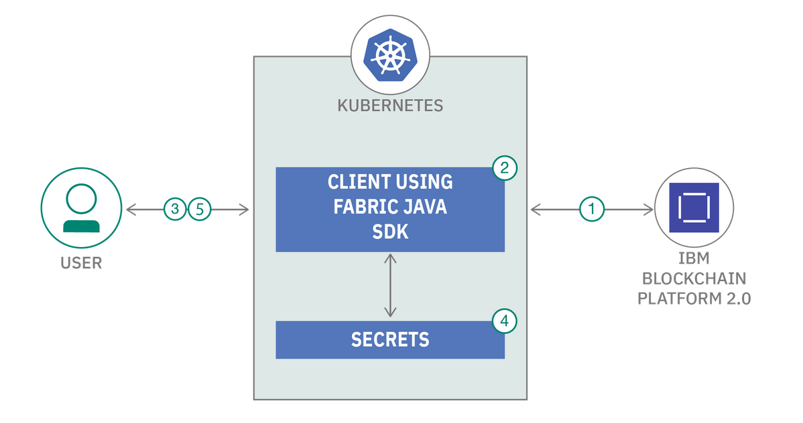

## Short Name

Modernize apps using IBM Transformation Advisor tool on IBM Cloud Pak for Applications

## Short Description

Transform your traditional on-premise application, and deploy it as a containerized app on IBM Cloud Pak for Applications running on Managed OpenShift

## Author
Shikha Maheshwari (https://developer.ibm.com/profiles/shikha.mah/)

Amol Ghanekar ()

## Code
https://github.com/IBM/k8-secrets-as-hyperledger-fabric-wallet

## Video
NA

## Summary

Security on the Hyperledger Fabric is enforced with digital signatures. All requests made to the fabric must be signed by users with appropriate enrollment
certificates. Once user is enrolled, application persist certificate in wallet for future usages. Explore this code pattern to understand what all types of wallets are available and how can we make it more sucure.

## Description

Hyperledger Fabric is private and permissioned. All requests made to Hyperledger Fabric must be signed by users with appropriate enrollment certificates. Once a user is enrolled, Fabric SDK saves the certificates in the wallet for future use. An application run by a user selects one of these identities 
when it connects to a channel. There are existing Fabric wallets like FileSystemWallet, CouchDBWallet which developers can leverage to store the registered user identities. The Hyperledger Fabric SDKs provides a default file system wallet for storing Fabric certificates. The FileSystem wallet stores user certificates in folders. This approach does not provide the required security or flexibility.
The security concern with the implementations where they “externalize” associated privateKey of the identity. It can be compromised if someone get access to these storage systems. Generally front-end client application and client SDK application (integration layer) gets deployed in the containerized environment i.e. into Kubernetes platform. 
So how about storing the wallet into Kubernetes platform itself? It would be considered more secure since it removes dependency to store wallet outside of Kubernetes platform.
 
This code pattern demonstrates the methodology to store wallet into Kubernetes platform as secrets and use the secrets while performing transaction using Fabric JAVA SDK.

## Flow

1. Set up Hyperledger Fabric network using IBM Blockchain Platform.
2. Deploy the client application built using Fabric Java SDK to communicate with blockchain network on IBM Kubernetes Cluster.
3. Users with Admin identity registers new users to the blockchain network and then new users enroll to the network.
4. The generated certificates will be stored as Kubernetes Secret. 
5. The certificates from Kubernetes Secrets will be used to do further transactions with blockchain network.

## Included components

* [IBM Blockchain Platform](https://www.ibm.com/in-en/blockchain/platform): IBM Blockchain Platform is an open-source blockchain and is transforming companies, driving growth, and creating new business models.

* [Fabric Java SDK](https://hyperledger-fabric.readthedocs.io/en/release-2.2/fabric-sdks.html): Hyperledger Fabric intends to offer a number of SDKs for a wide variety of programming languages. The first two delivered are the Node.js and Java SDKs.
   
* [DevOps Toolchain](https://www.ibm.com/cloud/architecture/toolchains): A toolchain is a set of tool integrations that support development, deployment, and operations tasks. The collective power of a toolchain is greater than the sum of its individual tool integrations.

## Featured technologies

* [Kubernetes Platform](https://kubernetes.io/docs/home/): Kubernetes is an open source container orchestration engine for automating deployment, scaling, and management of containerized applications.
* [Blockchain - Hyperledger Fabric](https://hyperledger-fabric.readthedocs.io/en/latest/): Hyperledger Fabric is a Blockchain Platform for the Enterprise.
* [Containers](https://www.ibm.com/cloud/learn/containers): Virtual software objects that include all the elements that an app needs to run.
* [Java](https://www.w3schools.com/java/java_intro.asp): A secure, object-oriented programming language for creating applications.

## Links

* [Quick start guide for IBM Blockchain Platform](https://developer.ibm.com/tutorials/quick-start-guide-for-ibm-blockchain-platform/)
* [Learn more about wallets of Hyperledger Fabric](https://hyperledger-fabric.readthedocs.io/en/release-1.4/developapps/wallet.html)
* [Understand about Kubernetes secrets](https://kubernetes.io/docs/concepts/configuration/secret/)
